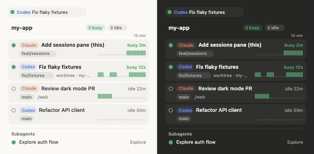

# repo-sessions

A Claude Code mod that shows which Claude Code sessions and Codex threads are working in the current repository or folder, and whether each one is busy or idle.



## What it shows

- **Pane** (`/sessions-here`): one card per session working in this folder, a subfolder, a parent folder, or another git worktree of the same repository. Each card has the agent (Claude or Codex), session name, busy or idle time, branch, location, and a 10-minute activity strip. This session's running subagents are listed below.
- **Band above the prompt**: appears only while another agent is busy in this repository.
- **Status line**: "N/M other sessions busy here".

The desktop Code tab draws SVG cards; the terminal draws a text version.

## How sessions are found

| Agent | Source | Busy when |
| --- | --- | --- |
| Claude Code | `~/.claude/sessions/<pid>.json` (skipped when the process has exited) | the session reports `busy` |
| Codex | `~/.codex/sessions/**/rollout-*.jsonl` written in the last 60 minutes; title from `~/.codex/session_index.jsonl` | its log was written in the last 30 seconds |

A Codex thread waiting for your approval shows as idle. Activity history starts when the mod loads.

## Install

Add the folder to the `env` block of `~/.claude/settings.json`, then start a new session:

```json
"env": {
  "CLAUDE_CODE_PLUGIN_DIRS": "~/GitHub & Coding Projects/repo-sessions"
}
```

For a single session: `claude --plugin-dir "~/GitHub & Coding Projects/repo-sessions"`.

## Development

```bash
claude plugin validate .
npx -p typescript tsc -p .
claude plugin test .
```

`tsconfig.json` extends `.claude-plugin/types/tsconfig.json`, which Claude Code generates when it loads the mod (run `/plugin-types` otherwise). `claude plugin test` needs the hooks-module rollout switch on for your account.
